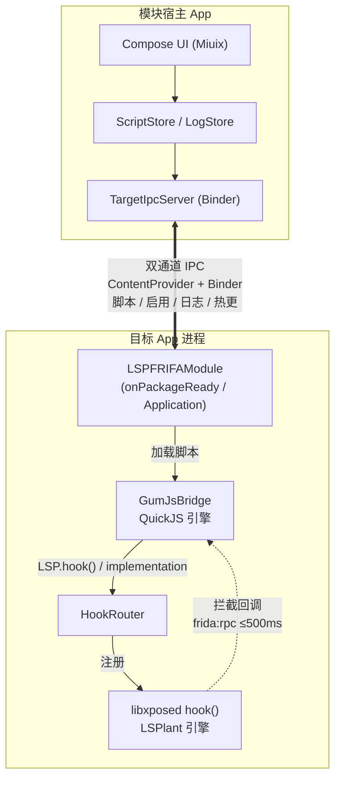

<div align="center">

# LSPFRIFA

**在 App 内直接跑 Frida 脚本 —— 不用 frida-server，不用连电脑。**

把 frida-java-bridge 的脚本体验，塞进一个 LSPosed 模块里。

[](https://www.gnu.org/licenses/gpl-3.0.html)
[-3DDC84?style=for-the-badge&logo=android&logoColor=white)](#-环境要求)
[](https://kotlinlang.org/)
[](https://frida.re/)
[](https://t.me/lspfrida)

**支持一下吧 → [t.me/lspfrida](https://t.me/lspfrida)**

</div>

---

## 📖 这是什么

**LSPFRIFA** 是一个 LSPosed 模块。它把一个 **Frida GumJS（QuickJS）脚本引擎**内置进目标 App 进程，
让你**在手机上直接**写、跑、调试 Frida 脚本 —— 不需要 `frida-server`、不需要 `adb`、不需要电脑。

脚本语法与 [frida-java-bridge](https://github.com/frida/frida-java-bridge) 兼容：

```js
Java.perform(function () {
  var A = Java.use("android.app.Activity");
  A.onResume.implementation = function () {
    console.log("onResume 被调用");
    return this.onResume();        // 调原方法
  };
});
```

> [!NOTE]
> **为什么不是"另一个 Frida 启动器"？**
> 传统 Frida 需要 PC 侧 `frida` 进程 + 目标设备跑 `frida-server`，脚本注入依赖 USB/网络调试通道。
> LSPFRIFA 把引擎直接编进模块（NDK 静态链接，零外部依赖），脚本由模块自己注入 —— **装上就能用**。
> Hook 引擎不走 Frida 的 ART 内部偏移方案，而是复用 LSPosed 自带的 **LSPlant**（跨版本更稳）。

---

## ✨ 核心特性

### ⚡ 引擎与注入

- **双引擎协作**
  - **脚本层**：Frida GumJS 17.9.3（QuickJS）—— 静态编入 APK，无外部依赖
  - **Hook 层**：`LSP.hook()` → HookRouter → libxposed `hook()`（**LSPlant**）—— A15 真机 ARMED/HIT 全链验证
- **提前注入**：在 `onPackageReady` 阶段即可注入（早于 `Application.onCreate`），比传统模块更早拿到执行权
- **类加载感知**：hook 未加载的类不再失败放弃，而是入队等类加载后自动挂上（三级再武装：锚点 flush / 轮询 / loadClass 监听）
- **安全兜底**：hook 注册超时 500ms 自动回退原方法，**永不卡死目标 App**

### 🧩 frida-java-bridge 语义

| API | 支持 |
|---|---|
| `Java.perform(fn)` / `Java.performNow(fn)` | ✅ 同步直执 |
| `Java.use("类名").方法.implementation = fn \| null` | ✅ |
| **观察模式**（fn 返回 `undefined` → 自动执行原方法） | ✅ |
| **替换模式**（返回非 `undefined` → 覆盖返回值） | ✅ |
| **async 支持**（`await this.method(新参数…)`） | ✅ 可改写参数 |
| **overload 精确选择**（`.overload('I','java.lang.String')`） | ✅ |
| `Java.available` / `Java.androidVersion` / `Java.isMainThread` | ✅ |
| `Java.choose` / `registerClass` / `cast` / `retain` | ❌ 明确报错（可读提示，不静默失败） |

### 🎨 界面（Miuix Compose · HyperOS 风格）

- **脚本编辑器**：sora-editor + **TextMate 语法高亮**（内置 VSCode Light+/Dark+ 主题）+ 撤销/重做 + 符号栏 + 自动保存
- **日志系统**：实时流 + 历史持久化（按包/按天，5000 行滚动保留）+ 级别色点 + 复制单条 + 导出全部 + 一键清除
- **视觉**：玻璃拟态（Liquid Glass）+ 超椭圆卡片 + 悬浮底栏 + **Monet 动态取色**（跟随壁纸）
- **热更新**：目标 App 在线时，改完脚本点「运行」立即生效，无需重启

---

## 🧱 架构



**关键设计**：JS 侧的 `LSP.hook()` 经消息上行 → `HookRouter` 解析 → `libxposed.hook()`，
拦截回调再经 **frida:rpc 协议**投回 JS（同步等待 ≤500ms，超时安全兜底）。
脚本与状态跨进程走 **remote prefs 双通道**，冷启动与热更行为一致。

---

## 🚀 快速开始

### 1️⃣ 环境要求

| 项 | 要求 |
|---|---|
| 系统 | Android 8.0+（API 26+） |
| Root 框架 | Magisk / KernelSU / APatch |
| Xposed | **LSPosed 2.1.1+**（libxposed API 102） |
| 真机验证 | 小米 23013RK75C · Android 15 · HyperOS |

### 2️⃣ 安装

1. 从 [Releases](https://github.com/wzxwhxcz/LSPFRIDA/releases) 下载 APK 安装
2. 打开 **LSPosed Manager** → 模块 → 启用 **LSPFRIFA**
3. 勾选**目标应用**（支持动态作用域申请，无需重启）
4. 打开目标应用 + 模块应用 → 详情页出现「已连接」即成功

### 3️⃣ 使用

```
详情页 → 脚本编辑 → 写脚本 → ▶ 运行（在线即热更；未连接则保存待注入）
详情页 → 日志     → 实时查看 / 复制 / 导出 / 清除
设置页 → 可开关「注入提示」（注入成功在目标 App 弹 Toast）
```

<details>
<summary><b>📜 更多脚本示例（点击展开）</b></summary>

**覆盖返回值 + overload 精确选择**

```js
Java.perform(function () {
  var Sys = Java.use("java.lang.System");
  Sys.currentTimeMillis.implementation = function () { return 1234567; };

  var A = Java.use("android.app.Activity");
  A.onCreate.overload("android.os.Bundle").implementation = function (b) {
    return this.onCreate(b);      // 透传（单次执行）
  };
});
```

**async 改写参数**

```js
Java.perform(function () {
  var B = Java.use("com.example.Target");
  B.check.implementation = async function (token) {
    console.log("原 token =", token);
    var r = await this.check("injected-token");   // 用新参数调原方法
    return r;
  };
});
```

**观察模式（不改行为，只留痕）**

```js
Java.perform(function () {
  var T = Java.use("com.example.Target");
  T.doWork.implementation = function () {
    console.log("doWork called");
    // 不 return → 自动执行原方法（观察语义）
  };
});
```

</details>

---

## 🛠️ 从源码构建

> [!IMPORTANT]
> **唯一手动步骤**：下载 Frida GumJS devkit（因体积 331 MB，未随仓库分发）

```bash
# 1. 下载 devkit（arm64）
wget https://github.com/frida/frida/releases/download/17.9.3/frida-gumjs-devkit-17.9.3-android-arm64.tar.xz

# 2. 解压到 CMake 要求的目录结构
mkdir -p app/src/main/cpp/frida-gumjs-devkit/arm64-v8a
tar -xf frida-gumjs-devkit-17.9.3-android-arm64.tar.xz -C app/src/main/cpp/frida-gumjs-devkit/arm64-v8a

# 3. 构建
./gradlew :app:assembleDebug
# 产物：app/build/outputs/apk/debug/app-debug.apk
```

**工具链**：JDK 17 · Android SDK（build-tools 36 / NDK 28.2）· CMake 3.22+

<details>
<summary><b>📱 AndroidIDE / RV2IDE 构建备注（点击展开）</b></summary>

- 项目已配置 SDK CMake（`3.22.1` 目录为自包含 arm64 构建，`bin` 替换为 CMake 4.x 内容）
- `cmake.dir` 修复 + `--undefined=_frida_sqlite3_initialize` 符号保留（无 GC 回收崩溃）
- 建议使用 **AndroidIDE 运行任务面板**构建
- **排查**：若遇到 `ninja: error: manifest 'build.ninja' still dirty after 100 tries`
  → 删除 `app/.cxx` 目录后重新构建（CMake copy-if-different 语义导致，详见 `CMakeLists.txt` 顶部注释）

</details>

---

## ⚠️ 已知限制

> [!WARNING]
> **当前为 v1.0 开发中版本** —— 以下为如实声明

| 限制 | 说明 |
|---|---|
| 复杂对象参数 | 对象/数组参数为 `__obj` 占位（基础类型映射完整） |
| 深度 VM API | `Java.choose` / `registerClass` / `cast` / `retain` 等**未实现**（调用会得到可读报错，不会静默失败） |
| 远程文件通道 | 只读（宿主无法向目标推送文件）→ 脚本分发走 remote prefs |
| ABI | 仅 **arm64-v8a**（32 位设备不支持） |

---

## 📚 文档

| 文档 | 内容 |
|---|---|
| [交接与验证状态](docs/Handoff-2026-09-26.md) | 架构 / 坑位库 / 验证矩阵 |
| [设计与实施记录](docs/Modules-And-Early-Injection-Design.md) | 提前注入 / 类加载感知 / 全部修复轮次 |
| [真机验证清单](docs/Verify-W1-W4-Checklist-2026-09-26.md) | W1–W4 分项验收表 |
| [路线B 事实簿](docs/RouteB-Facts.md) | frida-java-bridge 语义对齐细节 |
| [官方通道设计](docs/OfficialHookChannel-P0-Design.md) | LSP.hook → LSPlant 链路 |
| [日志持久化设计](docs/Log-Persistence-Design.md) | 日志系统架构 |

---

## 💬 交流 & 反馈

<div align="center">

[](https://t.me/lspfrida)
[](https://github.com/wzxwhxcz/LSPFRIDA/issues)

</div>

> [!TIP]
> 提交 Issue 前请附上：**目标 App 包名** · **LSPosed 版本** · **模块日志**（详情页 → 日志 → 导出）
> 有完整日志的问题，解决速度快 10 倍。

---

## 🙏 致谢

本项目站在这些开源项目的肩膀上：

- [**LSPosed**](https://github.com/LSPosed/LSPosed) — 现代 Xposed 框架，libxposed API
- [**LSPlant**](https://github.com/LSPosed/LSPlant) — ART Hook 引擎（本项目的 Hook 层核心）
- [**Frida**](https://frida.re/) — 脚本引擎与 `frida-java-bridge` 语义参考
- [**Miuix**](https://github.com/miuix-kotlin-multiplatform/miuix) — HyperOS 风格 Compose UI 库
- [**sora-editor**](https://github.com/Rosemoe/sora-editor) — Android 代码编辑器
- [**tm4e**](https://github.com/eclipse/tm4e) — TextMate 语法高亮
- [**Compose Multiplatform**](https://github.com/JetBrains/compose-multiplatform) / [AndroidX](https://github.com/androidx/androidx)

---

## ⚖️ 许可证

本项目代码以 **GPL-3.0** 发布。

依赖许可：frida-gumjs（LGPL-2.1，动态链接未修改）、sora-editor（LGPL-2.1）、LSPlant（LGPL-2.1）、
tm4e（EPL-2.0）、miuix（Apache-2.0）—— 详见各自项目页。